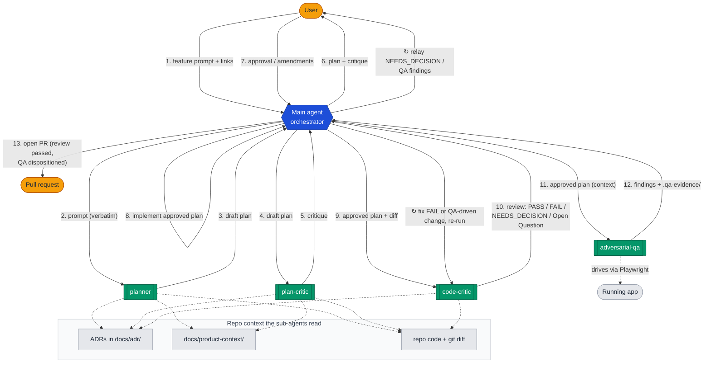

# AI-Assisted Development Workflow Guide

## Overview

This repo structures AI-assisted development as a real dev team: a **planner**,
a **plan critic**, a **code critic**, and **QA**, each in its own context
window, backed by one shared copy of the standards they apply — plus
deterministic gates below the LLM layer so the load-bearing rules don't rely
on anyone re-verifying them by hand. Implementation itself is *not*
delegated — the main agent plays the developer; sub-agents plan, critique,
and review.

Distributed as a single Claude Code plugin from `plugins/ai-workflow/` in
this repo's source — deliberately **Claude-native** (sub-agents, skills, the
`skills:` preload), with no portability layer. `AGENTS.md` still gives
baseline, cross-tool project context, but the deep agent/skill definitions
are Claude-specific.

> A project that scaffolds from this plugin starts with project-specific
> rules, commands, and product context left as placeholders in project-owned
> files — `AGENTS.md`, `docs/agent-rules/`, `docs/product-context/` (search
> for `[` and `TODO`). The skills and sub-agents themselves are
> project-agnostic and need no editing. See `README.md` for installing and
> adapting.

## Repository Structure

Shape of a project *after* installing the plugin and running `/init-workflow`:

```
project-root/
├── AGENTS.md                              # Lean project guide (canonical)
├── CLAUDE.md                              # Thin: imports AGENTS.md via `@AGENTS.md`
├── .claude/
│   └── settings.json                      # Permission rules guarding the review gate
├── githooks/
│   └── pre-push                           # Review gate: blocks pushes of unreviewed commits
├── scripts/
│   ├── review-ok.sh                       # Records a passing review for the current HEAD
│   └── check-hook-status.sh               # Reports whether the pre-push gate is actually wired up
├── docs/
│   ├── adr/                               # Architecture Decision Records
│   ├── agent-rules/                       # Project-owned skill extensions (read at runtime) —
│   │   ├── code-critic.md                 #   review rules + privacy anchors — Step 4 creates
│   │   └── plan-critic.md                 #   risk lenses — these two conditionally, see below
│   └── product-context/                   # Product vision, strategy, requirements
├── .gitignore                             # /init-workflow creates/appends this
└── src/<module>/AGENTS.md                 # Optional, NOT scaffolded — add these yourself
```

The canonical enumeration of what `/init-workflow` scaffolds is
`plugins/ai-workflow/skills/init-workflow/templates/` itself, not this tree —
this diagram is for human orientation and must stay in sync with
`templates/` (`AGENTS.md` Rule 5 in this repo requires it). Every file's own
destination gates its own scaffolding independently — a project that already
has its own `AGENTS.md` still gets the review gate (and vice versa).
`.claude/settings.json` is merged rather than overwritten if a project-scope
install already created it; the three gate files (`githooks/pre-push`,
`scripts/review-ok.sh`, `scripts/check-hook-status.sh`) are each checked for
their own identity before being scaffolded, never silently overwritten.
`docs/agent-rules/code-critic.md`/`plan-critic.md` are the one exception:
`/init-workflow` asks first whether the project already has equivalent docs
elsewhere and points `AGENTS.md` there instead of writing these two, if so
— see that skill's own Step 4 for the full logic.

The plugin itself (`plugins/ai-workflow/agents/`, `plugins/ai-workflow/skills/`)
is **not** vendored into the project — it lives wherever Claude Code resolves
the installed plugin's files. This guide isn't part of that payload either;
it's linked from `plugin.json`'s `homepage` field.

This repo (the plugin's own source) is the one exception: it carries the
plugin's real source *and*, side by side, its own real `AGENTS.md`/`CLAUDE.md`/
`.claude/settings.json`/`docs/agent-rules/*`, because it's a real project in
its own right. It does **not** carry project-local `.claude/skills/`/
`.claude/agents/` copies of its own tooling — tried and rejected, since with
the plugin also installed globally, Claude Code would show both bare
`/feature` and `/ai-workflow:feature` at once with no way to know if they'd
drifted. To dogfood `/feature` etc. on this repo, install the plugin the
same way any consumer would.

## The Three Layers: Skills, Sub-agents, Slash Commands

- **Skills** (`plugins/ai-workflow/skills/<name>/SKILL.md`) are the reusable
  knowledge — standards, checklists, rules, templates. **No orchestration
  concerns** — which is what lets one file back two consumers at once.
- **Sub-agents** (`plugins/ai-workflow/agents/<name>.md`) compose a skill with
  orchestration: frontmatter sets the tools/model/effort/permission the
  agent runs with and **preloads the skill** via `skills:` (Claude Code
  injects the full skill body at startup — sub-agents don't inherit skills
  from the parent conversation); the body says what context to gather, what
  to output, what not to touch.
- **Slash commands** are the skills invoked directly (`/plan-draft`,
  `/code-critic`, …) for ad-hoc use, skipping orchestration. `/feature` is
  the exception — its skill *is* the full orchestrated workflow.

One copy of the knowledge backs both a sub-agent (via preload) and its
matching slash command — nothing is duplicated, nothing can drift.

**Where project-specific content lives.** The skills are project-agnostic:
they name the project's commands, app URL, and default branch *by role*
from `AGENTS.md` → *Commands*, and read the project's own review rules and
risk lenses at runtime from whatever file `AGENTS.md`'s *Review & Planning
Guidance* section names — falling back to `docs/agent-rules/<skill>.md` if
that section is absent or incomplete, and to base rules alone if nothing is
found either way (code-critic states the absence rather than skipping
silently). This indirection means a project can point at a doc it already
had — a style guide, `CONTRIBUTING.md` — instead of duplicating content; see
*Installing and updating the plugin* for how `/init-workflow` decides which
applies. It's also what makes the skills portable as a single plugin rather
than a per-project copy.

Module-level `AGENTS.md` files are the place for constraints in critical
areas (auth, payments) where mistakes are expensive. `docs/adr/` holds
Architecture Decision Records; `docs/product-context/` holds the product
vision/strategy the planner and plan-critic ground their work in. Plans
themselves are never stored in the repo — the planner returns plan text to
the main agent, which presents it via plan mode.

## AGENTS.md

Contains the project overview, essential commands, and a reference to the
installed workflow plugin — not the workflow's own steps or standards,
which live in the plugin's skills. Reference them by role, not by a
hardcoded path (this template's own plugin happens to keep its skills at
`plugins/ai-workflow/skills/`, but that's an implementation detail a
project's `AGENTS.md` shouldn't depend on).

```markdown
# Project Name

## Overview
Brief description of the project, its purpose, and how it fits into the broader system.

## Tech Stack
- Language/framework versions, key dependencies, infrastructure

## Commands
- `[BUILD_CMD]` — Build the project
- `[TEST_CMD]` — Run all tests
- `[CHECK_CMD]` — All checks incl. tests
- `[RUN_CMD]` — Dev server (serves at `[APP_URL]`)
- default branch: `[DEFAULT_BRANCH]`

## Project Structure
- `src/api/` — HTTP handlers, request/response types
- `src/domain/` — Business logic, domain models
- `src/infra/` — Database, external service clients

## Key Context
- Product vision, strategy, requirements: `docs/product-context/`
- Architecture Decision Records: `docs/adr/`
- Sub-agents and skills: supplied by the installed AI workflow plugin

## Review & Planning Guidance
- Code review guidance: `docs/agent-rules/code-critic.md`
- Planning guidance: `docs/agent-rules/plan-critic.md`

## Workflow for New Features
Use the `/feature` slash command to trigger the full workflow (plan, critique,
implement, review, QA) with explicit gates between steps. See the installed
plugin's own documentation for the complete definition.
```

Keep `CLAUDE.md` thin, importing `AGENTS.md` with `@AGENTS.md` (this repo's
own approach) rather than a symlink — a single file under two names confuses
agents about which is canonical.

## The Skills

Each summary below is a pointer — the linked `SKILL.md` is the source of
truth. Keep each one focused (Claude Code recommends under ~500 lines; move
bulky reference material into sibling files in the skill's directory).

### `plugins/ai-workflow/skills/plan-draft/SKILL.md` — `/plan-draft`

Produces the implementation plan before any code is written. Opens with a
phone-sized **Approval Summary**, pins a **Contract** section before the
Approach, and treats **tests as the plan's deterministic oracle** — every
user-visible claim maps to a committed test tagged `[AC-n]`; manual "try X,
confirm Y" checklists are banned. Ambiguities surface as `NEEDS_DECISION` in
the plan text, never as questions from inside a sub-agent. (Named
`plan-draft`, not `plan`, to avoid colliding with Claude Code's built-in
plan-mode command.)

### `plugins/ai-workflow/skills/plan-critic/SKILL.md` — `/plan-critic`

Attacks a **draft plan** before it becomes commitment — a wrong plan means
downstream review and QA mostly verify that the wrong thing was built
correctly. Four mandatory methods (pre-mortem, inversion, load-bearing
assumptions, consistency with ADRs/product intent), each producing findings
or an explicit "no concerns, because…". Never rewrites the plan — suggestions
go in their own section; the developer decides. Project-specific risk
lenses live wherever `AGENTS.md`'s *Review & Planning Guidance* points
(defaulting to `docs/agent-rules/plan-critic.md`).

### `plugins/ai-workflow/skills/code-critic/SKILL.md` — `/code-critic`

Reviews the diff adversarially (assume something is wrong; a clean review
must document its disconfirmation attempt). It **owns test completeness** —
`/adversarial-qa` is exploratory, so verifying committed tests cover the
plan *and* the branches/boundaries the plan never enumerated lives here —
and its verdicts (`PASS` / `PASS (N/A)` / `FAIL` / `NEEDS_DECISION` / Open
Question) are what `/feature`'s gates key on. Base standards and privacy
rules live in the skill; project-specific rules and privacy anchors live
wherever `AGENTS.md`'s guidance section points (defaulting to
`docs/agent-rules/code-critic.md`). Any mechanically checkable rule should
graduate to a build-enforced test (next section), after which the reviewer
only checks the diff doesn't weaken it.

## Deterministic Enforcement — Below the LLM Layer

Instructions alone drift; three mechanisms enforce the load-bearing gates
mechanically. Two of the three only hold if the all-checks command actually
runs somewhere — `/feature` itself only runs the test command (Step 3),
never all-checks, so making that command run (locally, in a git hook, in
your own CI — whatever fits your project) is on you, not this plugin:

- **Architecture / fitness tests** encode mechanically checkable review
  rules as build failures (layer direction, banned APIs, required
  registrations, reserved route segments, …). code-critic verifies only
  that a diff doesn't *weaken* these tests, never re-derives the rules by
  hand. Start with the layer rule, below. <!-- [TODO: add fitness tests for
  your stack and list them as build-enforced rules in your code review
  guidance file.] -->
- **The pre-push review gate** (`githooks/pre-push`, enabled once per clone
  via `git config core.hooksPath githooks`): after a code-critic pass with
  no FAIL items, the agent records the reviewed HEAD with
  `scripts/review-ok.sh`; the hook refuses to push any other commit, so
  post-review changes force a re-review. Human bypass: `git push
  --no-verify`. The hook deterministically enforces **freshness** (the
  pushed commit is exactly the reviewed one), not the review's **verdict**
  — `review-ok.sh` records whatever it's told. The verdict is covered by
  the `ask` rule in `.claude/settings.json` (recording a pass always
  surfaces a human approval prompt, and the bypass flags are denied to
  agents, best-effort), and `review-ok.sh` warns whenever
  `scripts/check-hook-status.sh` reports the gate isn't actually active —
  not just an unset `core.hooksPath`, but a foreign hook occupying the spot
  too. (CI, if your project runs it, is further independent evidence that
  tests pass on the pushed state — but wiring that up is your project's own
  responsibility; this workflow's job ends at producing a well-vetted PR.)
- **Secret and dependency scanning** — wire a secret scanner (e.g. gitleaks)
  and a dependency audit into the all-checks command, so committed
  credentials and known-vulnerable dependencies are a build failure, not a
  matter of reviewer attention. <!-- [TODO: add a secret scanner and a
  dependency audit for your stack to the all-checks command.] -->

Deferred QA findings live as GitHub issues labeled **`known-issue`** — not in
the repo, not in session memory — so every agent and session sees the same
triage state.

### Your first fitness test: the layer rule

The highest-value fitness test is the **layer-dependency rule** — violations
are invisible in a diff (an `import` line looks harmless) but erode the
architecture over time. Universal, regardless of stack:

- **`domain` must not depend on `api`** — the core is independent of delivery.
- **`api` and `infra` must not depend on each other** — sibling outer layers stay decoupled.
- **No package cycles.**
- **`domain`↔`infra` is a convention choice** — forbid it for clean/hexagonal; allow it for traditional layered. Pick one.

Enforce it with the real dependency-analysis tool for your stack — never a
text/grep check, which can't see package semantics or cycles, and a gate
you can't fully trust defeats the purpose (a false green is worse than an
honest gap the reviewer still sees):

| Stack               | Tool                                             |
|---------------------|--------------------------------------------------|
| Kotlin / Java / JVM | ArchUnit (bytecode) or Konsist (Kotlin-native)   |
| TypeScript / JS     | dependency-cruiser or eslint-plugin-boundaries   |
| Python              | import-linter                                    |
| Go                  | depguard or arch-go                              |

Wire it into the all-checks command so a violation is a build failure, not
a reviewer judgment call, and list it as a build-enforced rule in your code
review guidance file. Add further fitness tests the same way — one per
mechanically checkable rule.

### `plugins/ai-workflow/skills/adversarial-qa/SKILL.md` — `/adversarial-qa`

**Exploratory and adversarial — not a re-verification of the spec.**
Committed end-to-end tests encode the plan's Requirements deterministically
(code-critic checks their completeness); this skill's job is to go
**beyond** them — drives the running app via Playwright MCP, probes past the
happy path, surfaces anything that looks wrong even outside the feature's
plan. Checks open `known-issue` GitHub issues so deferred findings are
reported as known, not re-triaged; STOPs on blockers with no curl/SQL
substitutes. Evidence lands in `.qa-evidence/` (gitignored, session-local),
which is why deferred findings must be fully described in their issue.

### `plugins/ai-workflow/skills/feature/SKILL.md` — `/feature`

The full lifecycle the **main** agent runs for non-trivial work: **plan →
critique → implement → test → code-review → QA → PR**. The gates worth
naming: the session must start on a human-created feature branch (agents
may not create one — Rule 3); plan mode is entered before any planning;
plan-critic may be skipped only for trivial changes **and** only when the
user explicitly asks; `[AC-n]` acceptance tests are written before
implementation and may not be weakened to pass; no push or PR until
code-critic passes with no FAIL items, escalated to Opus on security-surface
diffs; QA runs only for changes with a UI surface; the PR body carries the
pipeline's conclusions (plan summary, AC → test table, review outcome, QA
dispositions, test evidence).

### `plugins/ai-workflow/skills/init-workflow/SKILL.md` — `/init-workflow`

The bootstrap-and-adaptation pass, run once the plugin is installed (and
re-run any time as a doctor). Scaffolds whichever project-owned files are
missing from `templates/` — each file's own destination gates its own
scaffolding, so this runs the same on a brand-new project or one that
already has some of its own `AGENTS.md`/gate files — then adapts: detects
build/test commands and default branch, drafts `AGENTS.md` from the actual
codebase, points *Review & Planning Guidance* at existing docs or seeds new
ones, and validates the whole setup (hook wiring via
`scripts/check-hook-status.sh`, `CLAUDE.md` import, `.gitignore`, settings,
the `Commands` section, the guidance section resolving to real files).
Everything is proposed and confirmed before writing. Never edits the
plugin's own mechanism. (Named `init-workflow` to avoid colliding with
Claude Code's built-in `/init`.)

### `plugins/ai-workflow/skills/workflow-retro/SKILL.md` — `/workflow-retro`

Optional, run manually after a `/feature` session. Records the *outcome*
half of the workflow evaluation — which steps ran or were skipped, cycle
counts, what each critic caught and what was adopted — as one file per
feature branch in `.workflow-log/` (gitignored, lives under the main
worktree so records survive per-feature worktree deletion). Also records
the session's transcript ID(s) so `/workflow-inspect` can later join the
*cost* half. Over several features, these records are the evidence base for
tuning the workflow — see *Evolving the System*.

### `plugins/ai-workflow/skills/workflow-inspect/` — `/workflow-inspect`

The retro's companion, run any time after a retro while the session
transcripts still exist. Fills the record's `## Cost` section via a bundled
read-only script (`inspect.py`, requires `python3`): tokens and wall-clock
per sub-agent, and the handoff tax (files the planner read that the main
agent re-read). Fails soft on anything unparseable. The transcript format is
Claude Code internal and undocumented — the script observes it, it is not a
contract.

## Sub-agents

Each `plugins/ai-workflow/agents/<name>.md` file is YAML frontmatter
(tools/model/effort/permission + the one skill to preload) followed by the
body, written for the **autonomous** case — which also makes it usable
interactively via `claude --agent <name>`.

- **`planner`** — senior architect. Reads the prompt, linked docs, module
  `AGENTS.md`s, ADRs, product docs; applies `plan-draft`; returns plan text
  only.
- **`plan-critic`** — adversarial plan reviewer. Read-only (`permissionMode:
  plan`); applies `plan-critic`; surfaces concerns without rewriting.
- **`code-critic`** — strict reviewer. Read-only Bash inspection only (`git
  diff`, `git log`); never runs the test suite or mutates files; applies
  `code-critic`.
- **`adversarial-qa`** — QA engineer. Applies `adversarial-qa` to drive the
  running app via Playwright MCP tools and surface what the plan and tests
  missed.

There is no `feature` sub-agent — `feature` is a main-agent skill that
orchestrates the four above; `init-workflow`, `workflow-retro`, and
`workflow-inspect` are likewise main-agent-only, interactive rather than
delegated.

Design choices: only `planner` carries `WebFetch` (external specs enter at
exactly one point); the plan-stage critics run on the stronger model tier (a
bad plan poisons everything downstream), while `code-critic` runs a tier
lower by default and is escalated to Opus by `/feature` on security-surface
diffs. Each agent lists exactly the one skill it applies.

## How It Works

Triggering `/feature` runs this flow — solid arrows are information passed
between agents (numbered in flow order); **↻** marks loops outside the
linear sequence (re-review after fixes, decision relays); dotted arrows are
repo context a sub-agent reads:



Each sub-agent runs in its own isolated context — they never talk to each
other; the main agent is the only hub. Step 8 is a self-loop because
implementation is the main agent's own work, done between plan approval and
code review rather than delegated.

Skip criteria for plan-critic (Step 3): the change is plausibly under ~50
lines of non-test code, touches no *Sensitive Area*, introduces no new
public endpoint/persisted field/dependency, **and** the user explicitly
asked to skip it. QA (Step 8) does not re-check Requirements — that's locked
down by committed tests and code-critic; it looks for what they didn't
anticipate.

**Naming collisions, resolved by renaming rather than documenting around
them:** `code-critic` (not `code-review`, which Claude Code bundles and
would otherwise shadow this one), `plan-draft` (not `plan`, Claude Code's
built-in plan-mode command), `init-workflow` (not `init`, Claude Code's
built-in scaffolder). The bundled `/code-review ultra` — a billed, deeper
cloud review — stays reachable as an optional pass on especially high-stakes
changes.

*Unverified so far: whether an installed plugin's skills are namespaced
(`/ai-workflow:feature`) or exposed bare (`/feature`) — this hasn't been
exercised end-to-end yet. This guide uses the bare form as shorthand either
way.*

## Installing and Updating the Plugin

*Also unverified end-to-end — see `README.md` for what's confirmed so far.*

```
/plugin marketplace add cunhaax/ai-workflow-template
/plugin install ai-workflow@ai-workflow
```

Choose a scope (`user`/`project`/`local`) at install time. Project scope
records the install (and its pinned version, if any) in the project's own
`.claude/settings.json`, so the workflow version is committed and
reviewable like any other dependency bump.

Re-run `/init-workflow` after every plugin update — in doctor mode it
reports anything the update newly expects, the same as it reports any
other setup drift, with one exception: gate-file identity is checked by
content marker, not by being byte-current with the latest template, so a
stale copy from before the update can still read as genuine.

### Bundled MCP servers

`plugins/ai-workflow/.mcp.json` declares two MCP servers, both run via
pinned-version `npx` so nothing needs installing by hand:

- **`playwright`** (`@playwright/mcp`, `--browser chrome`) — the browser
  `adversarial-qa` drives (see *Sub-agents* above).
- **`context7`** (`@upstash/context7-mcp`) — up-to-date library/API docs.
  Not gated behind any sub-agent's `tools:` frontmatter — that restriction
  only applies to plugin sub-agents, not the main agent, which already has
  every session tool once the plugin is enabled. The `feature` skill's
  Step 2 (*Implement*) instructs the main agent to use it for
  version-sensitive library/API details instead of relying on
  training-time memory.

**Tool names are plugin-scoped, not bare.** Per the MCP reference
documentation, a tool from a plugin-bundled server is callable as
`mcp__plugin_<plugin-name>_<server-name>__<tool-name>` — e.g.
`mcp__plugin_ai-workflow_playwright__browser_click` — not the bare
`mcp__playwright__browser_click` form a project- or user-configured
server would use. `adversarial-qa.md`'s `tools:` allowlist and the
`context7` references in `feature/SKILL.md` both use the scoped form
already. If this plugin's `name` in `plugin.json` (currently
`ai-workflow`) ever changes, both must be updated in lockstep, or the
sub-agent's allowlist silently stops matching the real registered tools
and it loses every browser tool with no obvious error at review time.

Per Claude Code's plugin reference documentation, MCP servers bundled with
a plugin start whenever the plugin is *enabled* — not lazily, only when an
agent that uses them actually runs (this is documented product behavior,
distinct from the install-flow steps flagged as unverified above, which
this repo has not yet exercised end to end). Enabling this plugin in a
project therefore always spawns both server processes, and on first run
`npx` downloads each package itself. `--browser chrome` does **not**
additionally trigger a browser download on launch: Playwright looks for an
already-installed Google Chrome (or a channel previously provisioned via
`npx playwright install chrome`) and, if neither is present, throws an
actionable error rather than silently fetching one — the same
STOP-and-report posture as this project's other rules (see Rule 2 in
`AGENTS.md`), not a "just works everywhere" guarantee. A machine that
will run `/adversarial-qa` needs Chrome present one way or the other.
Versions are pinned deliberately (not `@latest`) so an upstream release
can't change QA behaviour underneath a project without a reviewed bump to
this file.

## Evolving the System

- **Start small.** Begin with the planner and code-critic; add QA and
  plan-critic once the basic workflow is stable.
- **Track failure patterns.** Every time an agent produces bad output your
  rules didn't catch, add a rule to whatever `AGENTS.md`'s *Review &
  Planning Guidance* section names for code review (`docs/agent-rules/code-critic.md`
  by default — the file is designed to accrete) or a lens to its planning
  counterpart (`docs/agent-rules/plan-critic.md` by default).
  The skills in `plugins/ai-workflow/skills/` stay project-agnostic and plugin-owned,
  so plugin updates never collide with your rules.
- **Tune the workflow itself with evidence, not intuition.** Run
  `/workflow-retro` at the end of feature sessions; the per-feature records in
  `.workflow-log/` show what each step cost and caught over time. A step
  that keeps producing nothing is a candidate for a skip rule or removal — a
  step that keeps catching real problems has earned its place. Change the
  workflow's steps on that record, not on how a single session felt.
- **Prefer build-enforced rules over prose.** When a new review rule is
  mechanically checkable, encode it as an architecture/fitness test instead of
  (or in addition to) skill text — tests don't drift, don't consume reviewer
  attention, and the human never has to re-verify them.
- **Keep `AGENTS.md` lean.** Project overview, commands, and a reference to the
  workflow skill — detailed standards and steps belong in the skills.
- **Keep each `SKILL.md` focused.** Under ~500 lines; when a skill outgrows that,
  move bulky reference material into sibling files in the skill's directory and
  reference them from `SKILL.md`.
- **Module-level docs for critical areas.** When a module has specific
  constraints, add an `AGENTS.md` in that directory rather than bloating the root.
- **Don't re-embed.** When updating this guide, summarize and link the canonical
  files in `plugins/ai-workflow/` rather than pasting their contents —
  verbatim copies are what drift.
